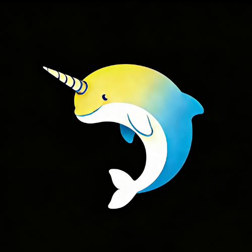
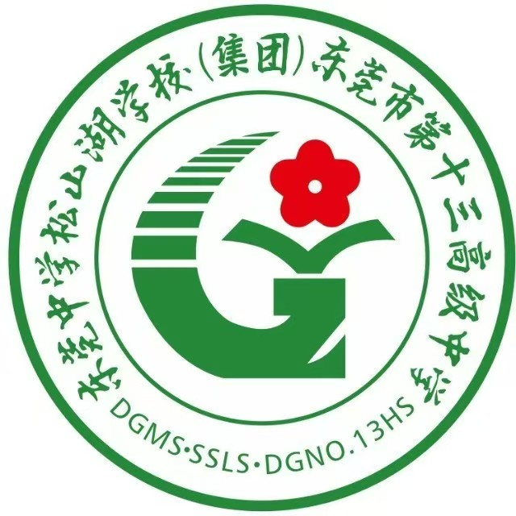

# SSL-Narwhal - A computer technology enthusiasts club from the shores of Songshan Lake
> Self-Confidence and Self-Reliance, Openness and Inclusiveness

<table>
  <tr>
    <td align="center" width="50%">
      
    </td>
    <td align="center" width="50%">
      
    </td>
  </tr>
  <tr>
    <td align="center"><small>SSL-Narwhal</small></td>
    <td align="center"><small>Dongguan No.13 High School</small></td>
  </tr>
</table>

## 🔬 Our Research
- **Program Language**
- **Internet of Things Development**
- **Cyber Security**
- **Basic Machine Learning**

## 🛠️ Open-Source Project
- [SSL-Narwhal-Wiki](https://SSL-Narwhal.github.io)
- [Fighting...](https://github.com/SSL-Narwhal/)

## 🔬 我们玩的一些东西
- **程序语言**
- **物联网开发（创客方向）**
- **网络安全**
- **基础机器学习技术**

## 🛠️ 我们的开源项目
- [SSL-Narwhal-Wiki](https://SSL-Narwhal.github.io)
- [敬请期待！](https://github.com/SSL-Narwhal/)

## Contact US & 联系我们
- **E-Mail: OpenDGSSZ2025@outlook.com**
- **社团负责人-zer0ptr(Hailin Zheng): iszhenghailin@gmail.com**
- **[SSL-Narwhal的个人空间-哔哩哔哩](https://b23.tv/QVStcA1)**
- **QQ: MjE2ODA1NjUxMg== (Base64 Encoding)**
